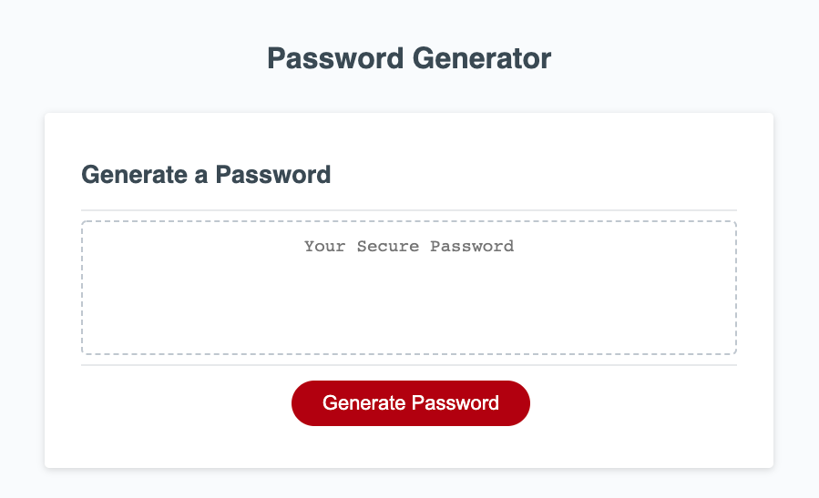
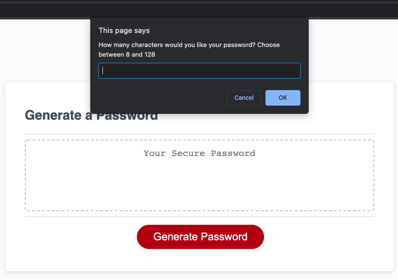

# Password-Generator

## Desciption
    This application Utilizes the use of HTML, CSS, and Javascript to generate a random, secure 
    assword for the user. This enables employees to generate random passwords based on criteria 
    that they’ve selected. This app runs in the browser and features dynamically updated HTML 
    and CSS powered by JavaScript code. This assignment illuminates the use of Javascript to 
    make dynamic changes to an HMTL document. 

## Link to Application 
The password generator is currently hosted by GitPages from a GitHub repository.

[Click here to see the deployed application!](https://gavinreid0.github.io/JavaScript-Password-Generator/)

## Usage
 * a user can generate a password by clicking the red "Generate Password" button. 
 * After clicking the user will be prompted to choose a value between 8 & 128 to determine how many characters their password should be.
 * Next the user will be alerted to select critia for there password including ("Will this contain numbers?", "Will this contain special characters?", "Will this contain Uppercase letters?", & "Will this contain Lowercase letters?") and the user may choose yes or no by clicking "cancel" for NO and "ok" for YES.
 * The text box will display the users password once it is generated. 

The following image shows the web application's apperance and functionality:

